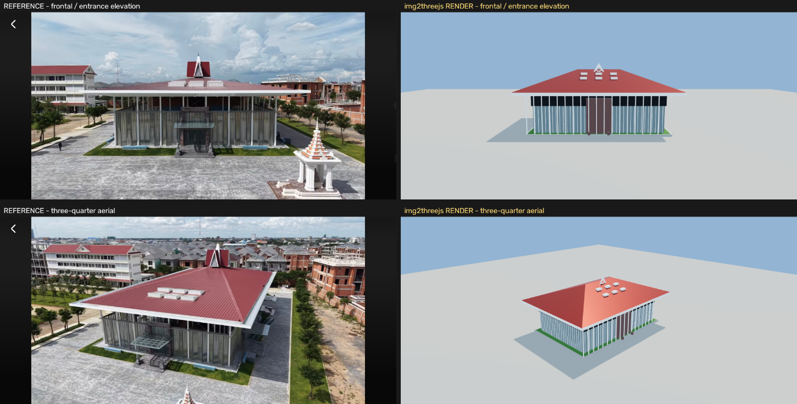

# Evaluation: `img2threejs` for CamboVerse

**Subject:** the NUM Great Hall, rebuilt from three drone photographs.
**Tool:** [`img2threejs`](https://github.com/img2threejs/img2threejs) v1.4.1, `Apache-2.0`.
**Date:** July 2026. **Verdict:** *useful, with a large caveat — see [Verdict](#verdict).*



---

## What the tool is

An **agent skill** (Claude Code / Codex / OpenCode), not a library. You give it a
reference image; it walks a gated pipeline —

```
blockout → structural → form-refinement → material → surface → lighting → interaction → optimization
```

— and emits an `ObjectSculptSpec` JSON plus a TypeScript factory
`createObjectNameModel(spec, options)` returning a `THREE.Group`. Its own tooling is
**Python 3.10+ standard library only**: no pip, no PIL, no numpy.

Nothing from it ships to the phone. The *output* is the contribution; the tool never
becomes a runtime dependency. That is the right shape for us.

## Licence and principles fit

| CamboVerse rule | Fit |
|---|---|
| Open licences only, no NC/ND | **Apache-2.0** — same as our viewer ✅ |
| Self-contained, no CDN or external runtime assets | Output is source code ✅ |
| Reviewable in git | TypeScript + JSON diffs, not binary blobs ✅ |
| Runs on a ~$150 Android over 4G | **Not enforced by the tool** — see below ⚠️ |

## What actually happened

All eight passes completed, with nine recorded reviews (one `refine-code`, eight
`continue`). The finished model is 34 meshes / 6,510 triangles and holds up from four
camera angles (the degenerate-view gate passes: silhouette-area ratios 0.95 and 1.09
against a 0.15 collapse threshold).

**The tool did not produce that on its own.** Getting there took four `refine-spec`
rounds and one `refine-code` round, and the code round meant hand-writing geometry the
generator cannot express.

### What the pipeline got right

- **The gates work, and they are honest.** When the roof was wrong, the feature gate
  refused to advance: `critical feature 'hip-roof-geometry' score 0.35 is below 0.8`.
  It will not let you mark a broken model complete. That is worth a great deal.
- **`--strict-quality` blocks shallow specs.** A single root component with one flat
  colour does not validate for a "complex" subject. It forces you to enumerate the
  parts before you write code.
- **The observation discipline is the real value.** Being made to write a detail
  inventory, name identity-defining features, and declare what a single view *cannot*
  show caught two errors in my own reading of the photographs: the building has a
  full-height **colonnade** with the glazed box set back behind it (I had first read it
  as a flush curtain wall), and the eave cantilever is roughly 6 m, not 3.5 m.
- **`delight_albedo.py`, `extract_pbr_evidence.py`, `diagnose_render.py` and the
  degenerate-view check** are all real, working, dependency-free tools.

### What blocked it

| # | Problem | Consequence |
|---|---|---|
| 1 | **`component.dimensions` is documentation only.** The generator emits `BoxGeometry(1,1,1,12,12,12)` and reads size from `transform.scale`. | First blockout was four unit cubes scattered over a 62 m footprint. |
| 2 | **No hip-roof primitive.** None of the 13 primitives can express a four-sided hip with a short ridge. | The single most identity-defining feature of this building had to be hand-written as a `BufferGeometry`. |
| 3 | **Repetition systems are radial-only.** The emitter always writes `ang = start + i*360/count`; `placement.mode: "linear"` is stored but never honoured. | A 37-bay mullion run renders as a ring. Hand-patched. |
| 4 | **Sizing via `transform.scale` breaks parenting.** Every non-root node then carries a non-unit scale, so children and instanced clusters inherit it. | The colonnade's 0.001 m datum plane flattened all 18 posts to nothing. Hierarchy had to be flattened to world space. |
| 5 | **`material-pass` *requires* extracted reference PBR maps** when a source image exists, so the built-in procedural-texture path is unreachable. | 26 MB of PNGs for nine materials — unshippable for us. |
| 6 | **Extracted albedo carries baked lighting even after de-lighting.** The crop-derived roughness/AO maps crushed the whole model to black, and the roof texture tiled the photograph's own AC units across the roof. | Final action was to drop the reference map set and drive colour from the spec's `colorMaterialRecipe`. |
| 7 | **Crop confidence measures extractability, not correctness.** Two mis-targeted crops (sampling red roof where I wanted white gable, and roof sheeting where I wanted shadow) both scored **0.86 "pass"**. | A wrong crop passes silently. Human verification of every crop is mandatory. |
| 8 | **Poly budget is not its problem.** Default budget is 250k triangles / 160 draw calls / 2048 textures, and every box is 3,456 triangles. | Dropping box segments 12 → 1 cut the blockout from 5,194 to 46 triangles. |
| 9 | **Linux friction.** Stdlib-only means PNG-only decoding (it shells out to macOS `sips` otherwise), so JPEG references are rejected until converted. PBR extraction runs ~25 s per crop. |  |
| 10 | **Field names live in the code, not the docs.** The extrude profile key is `geometryDescriptor.profile2D`, not `profile`; `ExtrudeGeometry` runs `z 0..depth` so every extruded part needs a half-length position offset. Both found by reading `generate_threejs_factory.py`. |  |
| 11 | **Hand fixes do not survive regeneration.** Every `refine-code` change must be kept as a re-appliable patch script. |  |

The local spec-search corpus is weapon-oriented — querying "hipped roof metal standing
seam" returned lathe-geometry advice for turned handles and CS2 alpha-channel notes.
There is no architectural knowledge in it yet.

## Cost

| | |
|---|---|
| Generated factory | 2,113 lines TypeScript |
| Spec | 256 KB JSON |
| Reviews recorded | 9 |
| Refine rounds needed | 4 × `refine-spec`, 1 × `refine-code` |
| Final model | 34 meshes, 6,510 triangles |
| Hand-written `GreatHall` in `CampusBuildings.tsx` | ~20 meshes |

Roughly a day of agent time for a result comparable to the hand-written version, which
is more compact and already integrated. **On this subject, today, it is not faster.**

## Verdict

**Adopt it for its process, not yet for its output.** Concretely:

1. **Use the observation protocol on every building we add.** The detail inventory and
   the "what does this single view hide" discipline are portable to
   [`docs/BUILDINGS.md`](./BUILDINGS.md) without installing anything, and they caught
   real errors in my reading of the reference here.
2. **Re-evaluate at v1.6 "The Environment Update"** (buildings, rooms, streets,
   vegetation, terrain-aware and multi-object reconstruction). Defects 2, 3 and 4 above
   are exactly what that release is supposed to address. Today it is a single-object
   tool and its demos are hard-surface props — CS2 knives, a BMX bike, earbuds.
3. **Never ship its material output as-is.** The extracted PBR path conflicts with our
   no-external-asset rule and its albedo carries baked lighting. Procedural
   `CanvasTexture` from the recipe colours, as elsewhere in this repo.
4. **Its budget is not our budget.** Anything generated must be re-checked against the
   ~$150-Android target before merge.

### Provenance rule if we adopt it

A procedural reconstruction from a photograph is a **derivative of that photograph**.
Contributors must use their own images or openly-licensed ones, and record the source
in the spec — the same discipline as [`docs/CAPTURE.md`](./CAPTURE.md). For heritage
subjects the cultural-consent layer applies on top, unchanged.

### Where it would help most today

Not temples. Khmer ornament — apsara relief, naga balustrades, lotus finials, Bayon
faces — is organic and well outside what a hard-surface pipeline reconstructs from one
photo. The good fit is **modern civic architecture**: schools, commune halls, health
centres, markets — the Digital Twin work in `docs/BUILDINGS.md`. That is where a
generated `ObjectSculptSpec` could genuinely replace hand-writing fifteen numbers into
a JSON spec, once the environment release lands.

---

*Reference photographs supplied by the CamboVerse Center. Model geometry and this
evaluation are `CC-BY-4.0`; the evaluated tool is `Apache-2.0`.*
